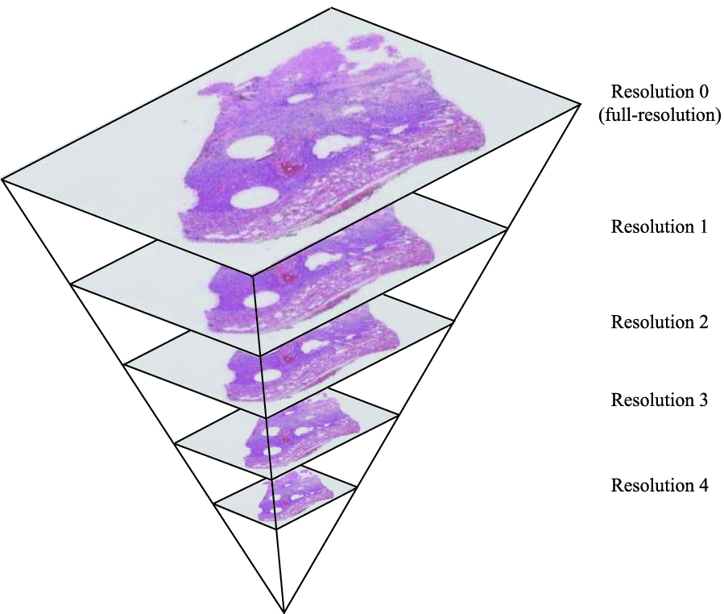

# PAIP 2020

To use the code, the user needs to set te environment variable to access the data. At your ~/.bashrc add:
```shell script
export PAIP2020_DATA_PATH='/path/to/data/PAIP2020/'
```

Also, the user needs to to pre-install a feew packages:
```shell script
$ pip install -r requirements.txt
```

## Data Description

Tenemos 47 imagenes de tipo svs. A whole-slide image is a digital representation of a microscopic slide, 
typically at a very high level of magnification, 20x. As a result of this high magnification, 
whole slide images are typically very large in size. 

A whole-slide image is created by a microscope that scans a slide and combines smaller images into a 
large image. Techniques include combining scanned square tiles into a whole-slide image and combining 
scanned strips into a resulting whole-slide image. 

This is a pyramidal, tiled format, where the massive slide is composed of a large number 
of constituent tiles.

Estas imagenes cuentan con 4 diferentes niveles/dimensiones de resolución como se muestra en la 
siguiente imagen.  



Por ejemplo, la imagen 'training_data_41.svs' cuenta con los niveles 
`((121512, 93068), (30378, 23267), (7594, 5816), (3797, 2908))`

#### Data Visualization

We can use the OpenSlide project to read a variety of whole-slide image formats, 
including the Aperio *.svs slide format of our training image set.

To use the OpenSlide Python interface to view whole slide images, 
we can clone the [OpenSlide Python interface from GitHub](https://github.com/openslide/openslide-python)
and use the included DeepZoom deepzoom_multiserver.py script.

```shell script
$ git clone https://github.com/openslide/openslide-python.git
$ cd openslide-python/examples/deepzoom
$ python3 deepzoom_multiserver.py -Q 100 WSI_DIRECTORY
```

The deepzoom_multiserver.py script starts a web interface on port 5000 and displays the image 
files at the specified file system location (the WSI_DIRECTORY value in the previous code).
If image files exist in subdirectories, they will also be displayed in the list of available slides.

Note: For remote data (ssh) use first:

```shell script
$ ssh -L 5000:localhost:5000 user@host
```

## Other

- Paip 2019 site [here](https://paip2019.grand-challenge.org/)
- Paip 2020 Gran Challenge site [here](https://paip2020.grand-challenge.org/Home/)
- Paip 2020 [data](http://wisepaip.org/challenge2020)
- Paip 2019 [GitHub](https://github.com/paip-2019/challenge) & Paip 2020 [GitHub](https://github.com/wisepaip/paip2020)
- [GitHub](https://github.com/PingjunChen/LiverCancerSeg) with data processing Paip 2019 
- IBM [Preprocessing](https://developer.ibm.com/technologies/data-science/articles/an-automatic-method-to-identify-tissues-from-big-whole-slide-images-pt1/)
- Paip 2019 [Best Result](https://drive.google.com/file/d/1NWJdZJFHajHfod5fgO7WnoRqYuQGN_tp/view), [Second](https://drive.google.com/file/d/14Jlv339SXF42vkwlqG5kYW-zGWw5O1Mh/view) and [Third](https://drive.google.com/file/d/1Q5gfmL7SQ_9YINx3J2PR4pQihNyIQxtL/view)